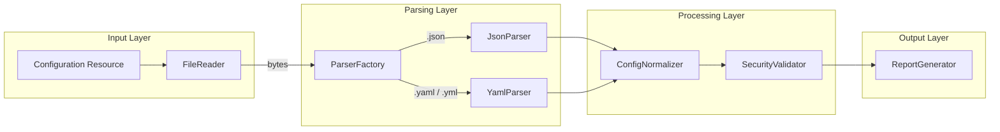
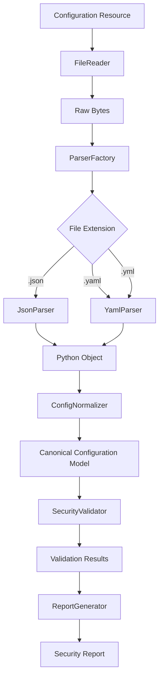
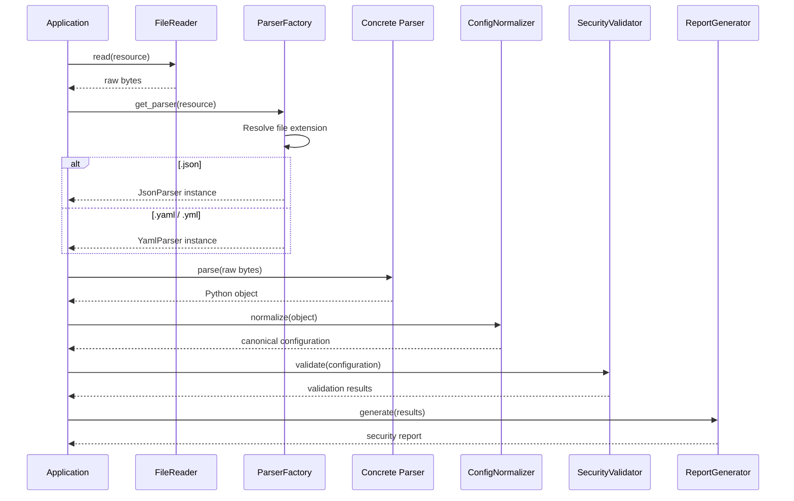

# Security Configuration Inspector
## Project Overview
### What problem does this project solve?
This project automates the scanning of configuration files against established security policies. It addresses the operational challenge of manually checking configurations for security misconfigurations, enabling teams to quickly identify security vulnerabilities, ensure compliance, and generate structured compliance reports automatically.

### Who is the intended user?
The primary intended user is a Security Analyst who needs to audit infrastructure configurations, ensure alignment with corporate or industry benchmarks, and generate compliance data.

---

# Architecture

## System Architecture



> **Note:** This diagram illustrates the static component architecture of the application. Runtime execution and data transformation are documented separately in the Processing Pipeline and Sequence Diagram.

---

## Processing Pipeline

The system processes data linearly through decoupled components:



---

## Sequence Diagram



---

# Features

## Current Features

- Binary-safe file ingestion
- JSON configuration parsing
- Extensible parser selection via `ParserFactory`
- Dynamic parser registration
- Comprehensive custom exception hierarchy
- Unit-tested architecture
- Clean Architecture inspired component boundaries

## Planned Features

- YAML support
- Configuration normalization
- Security policy engine
- HTML report generation
- JSON/CSV report export
- REST API integration

---

# Installation

Clone the repository:

```bash
git clone https://github.com/<username>/SecurityConfigInspector.git

cd SecurityConfigInspector
```

Create a virtual environment:

```bash
python -m venv .venv
```

Activate it.

Windows

```bash
.venv\Scripts\activate
```

Linux/macOS

```bash
source .venv/bin/activate
```

Install dependencies

```bash
pip install -r requirements.txt
```

Run tests

```bash
python -m pytest
```

---

# Usage

The command-line interface is currently under development.

At this stage, components can be exercised independently through unit tests:

```bash
python -m pytest
```

Future releases will support:

```bash
python main.py config.json
```

---

# Development Progress

| Component | Status |
|-----------|:------:|
| Project Setup | ✅ |
| BaseReader | ✅ |
| FileReader | ✅ |
| BaseParser | ✅ |
| JsonParser | ✅ |
| ParserFactory | ✅ |
| Unit Tests | ✅ |
| ConfigNormalizer | ⏳ |
| SecurityValidator | ⏳ |
| ReportGenerator | ⏳ |
| CLI | ⏳ |

---

# Milestones & Roadmap

## What is the current scope of Sprint 1?
Sprint 1 establishes the baseline engineering foundation and ingestion pipeline.
* Infrastructure Setup: Project structure initialization, Python virtual environment configuration, and Git repository setup.
* Ingestion Layer: Implementation of BaseReader and FileReader to ingest raw text data.
* Parsing Layer: Implementation of BaseParser, JsonParser, YamlParser, and a dynamic ParserFactory to auto-detect and deserialize files.
* Quality Assurance: Unit test suites ensuring parsing reliability.
* Deliverable: A system that ingests a JSON or YAML file and successfully converts it into a native Python object.

## What are the planned future enhancements?
The roadmap details the progressive addition of core logic, verification capabilities, and integrations:
* Sprint 2 (Normalization): Integration of ConfigNormalizer, field mapping rules, and a canonical schema to ensure uniform internal representation regardless of source format.
* Sprint 3 (Security Validation): A robust policy engine implementing CIS-style security rules providing structured evaluation outcomes (PASS / FAIL / WARNING).
* Sprint 4 (Reporting & Observability): Multi-format reporting export options (HTML, JSON, CSV) alongside detailed system logging.
* Sprint 5 (Integration): Integration capabilities to consume REST APIs.
* Extensibility: Long-term architectural goals include native support for additional configuration formats such as XML and TOML.

---

# Non-Functional Requirements

## Performance
The application should process 100 configuration files in under 5 seconds.
## Maintainability
New parsers should be added without modifying existing validator code.
## Reliability
Malformed input should produce informative errors rather than crashes.
## Security
No secrets shall be hardcoded.
Credentials must come from environment variables or configuration files.

---

# Project Structure

```
SecurityConfigInspector/

├── docs/
│   ├── architecture.md
│   ├── developer-guide.md
│   ├── testing_strategy.md
│   └── adr/
│
├── src/
│   ├── readers/
│   ├── parsers/
│   ├── factories/
│   ├── exceptions/
│   └── ...
│
├── tests/
│   ├── readers/
│   ├── parsers/
│   └── factories/
│
├── requirements.txt
├── pyproject.toml
└── README.md
```

---

# Documentation

The project documentation includes:

- Architecture Overview
- Processing Pipeline
- Sequence Diagrams
- Architecture Decision Records (ADRs)
- Developer Guide
- Testing Strategy
- Learning Journal

---

# Engineering Principles

This project is intentionally designed as a portfolio-quality software engineering project.

Key principles include:

- SOLID principles
- Separation of Concerns
- Clean Architecture
- Dependency Inversion
- Domain-specific exception hierarchy
- Test-driven thinking
- Extensible component design

---

# Testing

The project emphasizes contract-driven unit testing.

Current coverage includes:

- FileReader
- JsonParser
- ParserFactory

Tests verify:

- Happy paths
- Boundary conditions
- Exception translation
- Public API contracts
- Dynamic parser registration

---

# License