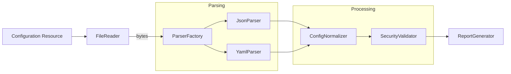

# Security Configuration Inspector

## Project Overview

The Security Configuration Inspector is a security-focused Python application for scanning infrastructure configuration files against established security policies.

The project is designed to help Security Analysts identify configuration weaknesses, support compliance checking, and eventually generate structured security reports.

## Current Project State

The ingestion, parsing, and configuration-normalization foundations are implemented and tested.

Current pipeline:

```text
Configuration File
      │
      ▼
  FileReader
      │ raw bytes
      ▼
 ParserFactory
   /       \
  ▼         ▼
JSON       YAML
Parser     Parser
  \         /
   ▼       ▼
ConfigNormalizer
      │
      ▼
Canonical Configuration
      │
      ▼
SecurityValidator       ← Next major component
      │
      ▼
ReportGenerator
```

`SecurityValidator`, reporting, and the CLI remain planned implementation work.

---

# Current Features

- Binary-safe file ingestion.
- JSON configuration parsing.
- YAML configuration parsing.
- Secure YAML loading through `yaml.safe_load()`.
- Extensible parser selection through `ParserFactory`.
- Runtime parser registration.
- Case-insensitive `.json`, `.yaml`, and `.yml` extension handling.
- Application-level parser, reader, factory, and normalizer exceptions.
- `BaseNormalizer` abstraction.
- `ConfigNormalizer` canonicalization.
- Required `port` validation.
- Canonical defaults for optional SSH-related fields.
- Source-field alias resolution.
- Ambiguity detection for conflicting aliases.
- Strict field type/value validation.
- `allow_users` trimming and deduplication.
- Input immutability through deep-copy normalization.
- Unknown-field preservation.
- JSON/YAML cross-format equivalence testing.
- Full configuration normalization integration testing.
- Comprehensive pytest coverage for implemented components.

---

# ConfigNormalizer

`ConfigNormalizer` is the current completed Sprint 2 component.

It creates the canonical configuration boundary between parser output and future security validation.

## Canonical Schema

| Field | Type | Requirement | Default |
|---|---|---|---|
| `port` | `int` | Required, 1–65535 | — |
| `permit_root_login` | `bool` | Optional | `False` |
| `password_authentication` | `bool` | Optional | `False` |
| `protocol_version` | `int` | Optional, must be `2` | `2` |
| `max_auth_tries` | `int` | Optional, positive | `3` |
| `allow_users` | `list[str]` | Optional | `[]` |

## Alias Examples

The normalizer accepts source representations such as:

```text
listen_port       → port
root_login        → permit_root_login
password_auth     → password_authentication
protocol          → protocol_version
max_retries       → max_auth_tries
allowed_users     → allow_users
```

If multiple representations of the same field disagree, normalization fails with `ConfigurationInvalidError`.

Unknown fields are preserved rather than silently discarded.

---

# Architecture


```mermaid
flowchart LR
    Resource["Configuration Resource"] --> Reader["FileReader"]

    subgraph Parsing["Parsing"]
        Factory["ParserFactory"]
        JSON["JsonParser"]
        YAML["YamlParser"]
    end

    subgraph Processing["Processing"]
        Normalizer["ConfigNormalizer"]
        Validator["SecurityValidator"]
    end

    Reporter["ReportGenerator"]

    Reader -->|bytes| Factory
    Factory --> JSON
    Factory --> YAML
    JSON --> Normalizer
    YAML --> Normalizer
    Normalizer --> Validator
    Validator --> Reporter
```

The normalizer is deliberately separate from security policy evaluation:

```text
ConfigNormalizer
    = representation + structural correctness

SecurityValidator
    = security policy evaluation
```

---

# Installation

Clone the repository and enter the project directory:

```bash
git clone https://github.com/<username>/SecurityConfigInspector.git
cd SecurityConfigInspector
```

Create and activate a virtual environment:

### Windows

```bash
python -m venv .venv
.venv\Scripts\activate
```

### Linux/macOS

```bash
python -m venv .venv
source .venv/bin/activate
```

Install dependencies:

```bash
pip install -r requirements.txt
```

---

# Testing

Run the complete test suite:

```bash
python -m pytest -v
```

The current suite covers:

- `FileReader`
- `JsonParser`
- `YamlParser`
- `ParserFactory`
- `ConfigNormalizer`
- Cross-format JSON/YAML normalization
- Full configuration normalization integration

The project uses contract-focused tests with boundary, error, immutability, alias, and canonicalization coverage.

---

# Development Progress

| Component | Status |
|---|:---:|
| Project Setup | ✅ Complete |
| BaseReader | ✅ Complete |
| FileReader | ✅ Complete |
| BaseParser | ✅ Complete |
| JsonParser | ✅ Complete |
| YamlParser | ✅ Complete |
| ParserFactory | ✅ Complete |
| BaseNormalizer | ✅ Complete |
| ConfigNormalizer — Structural Contract | ✅ Complete |
| ConfigNormalizer — Canonical Schema | ✅ Complete |
| ConfigNormalizer — Field Mapping & Aliases | ✅ Complete |
| ConfigNormalizer — Ambiguity Handling | ✅ Complete |
| ConfigNormalizer — `allow_users` Canonicalization | ✅ Complete |
| ConfigNormalizer — Cross-format Integration | ✅ Complete |
| SecurityValidator | ⬜ Planned |
| ReportGenerator | ⬜ Planned |
| CLI | ⬜ Planned |

---

# Milestones & Roadmap

## Sprint 1 — Ingestion and Parsing

Completed:

- Project setup and Git workflow.
- `BaseReader` and `FileReader`.
- `BaseParser`, `JsonParser`, and `YamlParser`.
- `ParserFactory`.
- Parser and factory tests.
- Architecture documentation.

**Deliverable:** JSON and YAML configuration data can be read and converted into native Python objects.

## Sprint 2 — Configuration Normalization

Completed:

- `BaseNormalizer`.
- `ConfigNormalizer`.
- Root mapping validation.
- Required `port` contract.
- Canonical defaults.
- Strict field validation.
- Source-to-canonical aliases.
- Ambiguity detection.
- `allow_users` canonicalization.
- Input immutability.
- Unknown-field preservation.
- JSON/YAML equivalence integration.
- Full configuration integration testing.

**Deliverable:** Parser output can be transformed into a stable canonical configuration representation suitable for security validation.

## Sprint 3 — Security Validation

Planned:

- `BaseValidator`.
- `SecurityValidator`.
- Structured PASS / FAIL / WARNING findings.
- CIS-style security rules.
- Policy evaluation against canonical configuration.

## Sprint 4 — Reporting & Observability

Planned:

- HTML reporting.
- JSON/CSV reporting.
- Structured logging.
- Useful diagnostic output.

## Sprint 5 — Application Integration

Planned:

- CLI orchestration.
- End-to-end scanning workflow.
- Future REST/API integration where appropriate.

## Long-Term Extensibility

Potential future support includes:

- Additional configuration formats such as TOML and XML.
- Additional security policy sets.
- More advanced reporting and integrations.

---

# Project Structure

```text
SecurityConfigInspector/
├── docs/
│   ├── architecture.md
│   ├── developer-guide.md
│   ├── learning-journal.md
│   └── testing_backlog.md
├── src/
│   ├── exceptions/
│   ├── normalizers/
│   ├── parsers/
│   ├── readers/
│   ├── reporters/
│   ├── utils/
│   └── validators/
├── tests/
│   ├── integration/
│   ├── normalizers/
│   ├── parsers/
│   └── readers/
├── requirements.txt
├── pyproject.toml
└── README.md
```

---

# Engineering Principles

The project is intentionally being developed as a portfolio-quality engineering project.

Key principles:

- SOLID principles.
- Separation of Concerns.
- Clean Architecture.
- Dependency Inversion.
- Domain-specific exception hierarchy.
- Contract-driven testing.
- Test-driven development.
- Defensive handling of untrusted configuration input.
- Extensible component boundaries.
- Small, reviewable Git changes.

---

# Development Workflow

Feature work follows:

```text
Issue / test contract
        ↓
Feature branch
        ↓
Failing test
        ↓
Minimal implementation
        ↓
Focused test
        ↓
Full test suite
        ↓
Documentation
        ↓
Commit
        ↓
Pull Request
        ↓
Merge
        ↓
Sync main
```

The preferred state before starting new work is a clean, synchronized `main` branch.

---

# Documentation

Current project documentation includes:

- `docs/architecture.md` — system architecture and processing pipeline.
- `docs/developer-guide.md` — development conventions and component contracts.
- `docs/testing_backlog.md` — test contracts and roadmap.
- `docs/learning-journal.md` — lessons learned and engineering reflections.

---

# License

See the repository license file for licensing information.
