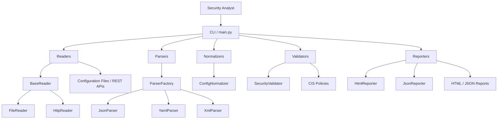
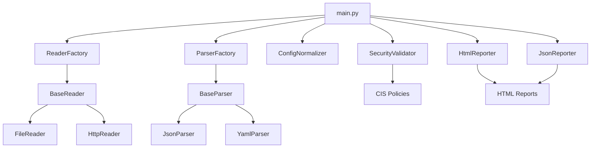
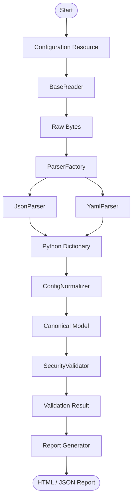
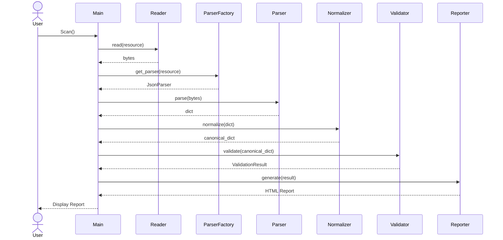

# System Architecture

> **Note:** This diagram illustrates the static component architecture of the application. Runtime execution and data transformation are documented separately in the Processing Pipeline and Sequence Diagram
---

# Component Architecture

---

# Processing Pipeline

--- 

# Sequence Diagram

---

## Design Priciples

---

## Project Structure

---

## Dependencies

