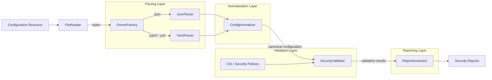
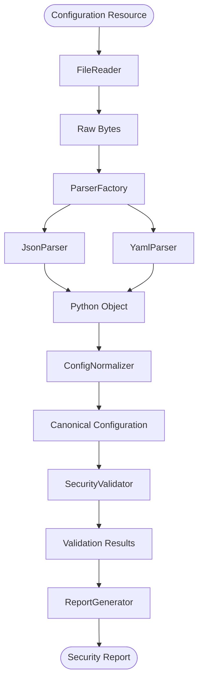
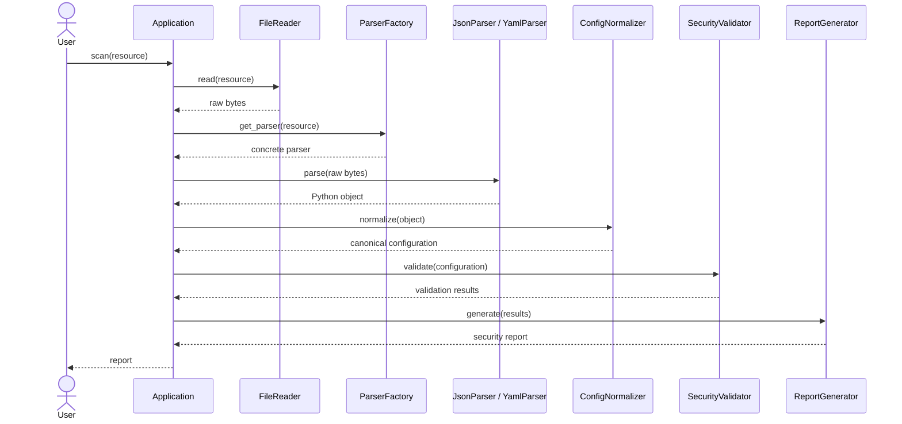

# System Architecture

## Overview

The Security Configuration Inspector is organized as a decoupled processing pipeline:

```text
Configuration Resource
        │
        ▼
    FileReader
        │ raw bytes
        ▼
   ParserFactory
      /     \
     ▼       ▼
JsonParser YamlParser
      \     /
       ▼   ▼
  ConfigNormalizer
        │
        ▼
Canonical Configuration
        │
        ▼
 SecurityValidator
        │
        ▼
   ReportGenerator
```

The architecture separates I/O, parsing, normalization, security validation, and reporting so that each component has a focused responsibility.

## System Architecture


```mermaid
flowchart LR
    Resource["Configuration Resource"] --> Reader["FileReader"]

    subgraph Parsing["Parsing Layer"]
        Factory["ParserFactory"]
        JSON["JsonParser"]
        YAML["YamlParser"]
    end

    subgraph Normalization["Normalization Layer"]
        Normalizer["ConfigNormalizer"]
    end

    subgraph Validation["Validation Layer"]
        Validator["SecurityValidator"]
        Policies["CIS / Security Policies"]
    end

    subgraph Output["Reporting Layer"]
        Reporter["ReportGenerator"]
    end

    Reader -->|bytes| Factory
    Factory -->|.json| JSON
    Factory -->|.yaml / .yml| YAML
    JSON --> Normalizer
    YAML --> Normalizer
    Normalizer -->|canonical configuration| Validator
    Policies --> Validator
    Validator -->|validation results| Reporter
    Reporter --> Reports["Security Reports"]
```

> This diagram represents the current component architecture. `SecurityValidator`, reporting, and CLI orchestration remain planned implementation work.

## Component Responsibilities

### FileReader

Responsible for retrieving configuration resources as raw bytes.

It does not interpret the contents of the file.

### ParserFactory

Selects a concrete parser from the resource extension.

Current registrations:

- `.json` → `JsonParser`
- `.yaml` → `YamlParser`
- `.yml` → `YamlParser`

The factory accepts both `str` and `pathlib.Path`, normalizes extensions, and supports runtime parser registration.

### JsonParser

Converts UTF-8 JSON bytes into native Python objects using `json.loads()`.

It translates decoding and JSON syntax failures into project-specific exceptions.

### YamlParser

Converts UTF-8 YAML bytes into native Python objects using `yaml.safe_load()`.

Using `safe_load()` is an intentional security boundary that prevents arbitrary Python object construction during YAML deserialization.

### ConfigNormalizer

`ConfigNormalizer` is the current Sprint 2 component.

It establishes the canonical configuration boundary between parser output and security validation.

Its current responsibilities are:

- Require a dictionary at the configuration root.
- Reject `None`, lists, scalars, and other non-mapping roots.
- Deep-copy the input so the caller's object is not mutated.
- Resolve supported source-field aliases into canonical names.
- Detect conflicting representations of the same canonical field.
- Enforce required and optional field rules.
- Apply canonical defaults.
- Validate canonical field types and values.
- Normalize `allow_users` values by trimming whitespace and removing duplicates while preserving order.
- Preserve unknown configuration fields.
- Produce equivalent canonical output for semantically equivalent JSON and YAML configurations.

### SecurityValidator

Planned Sprint 3 component.

It will evaluate canonical configuration data against security policies and produce structured findings.

### ReportGenerator

Planned reporting component.

It will consume validation results and produce user-facing security reports.

## Current ConfigNormalizer Contract

The normalizer accepts a root dictionary and returns a deep-copied canonical dictionary.

```text
Input
  │
  ├── dict ----------------------> normalize
  │
  └── non-dict ------------------> ConfigurationInvalidError
```

For accepted mappings:

- Empty mappings are no longer valid because the canonical `port` field is required.
- `port` must be an integer from `1` through `65535`.
- `bool` is explicitly rejected as a valid port because `bool` is a subclass of `int` in Python.
- Optional fields receive canonical defaults.
- Aliases are resolved.
- Conflicting aliases raise `ConfigurationInvalidError`.
- Unknown fields are preserved.
- Input data remains unchanged.

## Canonical Configuration Schema

| Canonical Field | Python Type | Requirement | Default | Description |
|---|---|---|---|---|
| `port` | `int` | Required, 1–65535 | None | Network listening port |
| `permit_root_login` | `bool` | Optional | `False` | Whether direct root login is permitted |
| `password_authentication` | `bool` | Optional | `False` | Whether password-based authentication is allowed |
| `protocol_version` | `int` | Optional, must be `2` | `2` | SSH protocol version |
| `max_auth_tries` | `int` | Optional, positive | `3` | Maximum authentication attempts |
| `allow_users` | `list[str]` | Optional | `[]` | Explicitly permitted usernames |

## Source-to-Canonical Aliases

| Source Keys | Canonical Field |
|---|---|
| `port`, `Port`, `listen_port`, `listening_port`, `ListenPort`, `ssh_port` | `port` |
| `permit_root_login`, `PermitRootLogin`, `root_login` | `permit_root_login` |
| `password_authentication`, `PasswordAuthentication`, `allow_passwords`, `password_auth` | `password_authentication` |
| `protocol_version`, `Protocol`, `protocol` | `protocol_version` |
| `max_auth_tries`, `MaxAuthTries`, `max_auth`, `max_retries` | `max_auth_tries` |
| `allow_users`, `AllowUsers`, `allowed_users`, `users` | `allow_users` |

### Ambiguity Rule

If multiple representations of the same canonical field are supplied, their values must agree.

For example:

```python
{"port": 22, "listen_port": 22}
```

is valid.

```python
{"port": 22, "listen_port": 2222}
```

is ambiguous and raises `ConfigurationInvalidError`.

The normalizer does not silently choose one conflicting value.

## `allow_users` Canonicalization

The current contract is:

```text
allow_users
    │
    ├── must be a list
    ├── every item must be a string
    ├── empty usernames are rejected
    ├── whitespace-only usernames are rejected
    ├── surrounding whitespace is trimmed
    ├── duplicates are removed
    └── first-occurrence order is preserved
```

Therefore:

```python
["  admin  ", "auditor", "admin"]
```

becomes:

```python
["admin", "auditor"]
```

## Cross-Format Integration

Equivalent JSON and YAML representations are expected to normalize to the same canonical dictionary.

```text
JSON bytes ──> JsonParser ──┐
                            ├──> ConfigNormalizer ──> canonical dict
YAML bytes ──> YamlParser ──┘
```

This behavior is covered by N-044 and the complete configuration integration test N-046.

## Processing Pipeline


```mermaid
flowchart TD
    Start([Configuration Resource])
    Start --> Reader["FileReader"]
    Reader --> Bytes["Raw Bytes"]
    Bytes --> Factory["ParserFactory"]
    Factory --> JSON["JsonParser"]
    Factory --> YAML["YamlParser"]
    JSON --> Object["Python Object"]
    YAML --> Object
    Object --> Normalizer["ConfigNormalizer"]
    Normalizer --> Canonical["Canonical Configuration"]
    Canonical --> Validator["SecurityValidator"]
    Validator --> Findings["Validation Results"]
    Findings --> Reporter["ReportGenerator"]
    Reporter --> End([Security Report])
```

## Runtime Sequence


```mermaid
sequenceDiagram
    actor User
    participant App as Application
    participant Reader as FileReader
    participant Factory as ParserFactory
    participant Parser as JsonParser / YamlParser
    participant Normalizer as ConfigNormalizer
    participant Validator as SecurityValidator
    participant Reporter as ReportGenerator

    User->>App: scan(resource)
    App->>Reader: read(resource)
    Reader-->>App: raw bytes
    App->>Factory: get_parser(resource)
    Factory-->>App: concrete parser
    App->>Parser: parse(raw bytes)
    Parser-->>App: Python object
    App->>Normalizer: normalize(object)
    Normalizer-->>App: canonical configuration
    App->>Validator: validate(configuration)
    Validator-->>App: validation results
    App->>Reporter: generate(results)
    Reporter-->>App: security report
    App-->>User: report
```

## Design Principles

- Separation of Concerns
- SOLID principles
- Dependency Inversion
- Domain-specific exception handling
- Contract-driven testing
- Test-driven development
- Defensive deserialization
- Extensible component boundaries
- Explicit canonicalization rules

## Current Project Structure

```text
SecurityConfigInspector/
├── docs/
│   ├── architecture.md
│   ├── developer-guide.md
│   ├── learning-journal.md
│   └── testing_backlog.md
├── src/
│   ├── exceptions/
│   ├── normalizers/
│   ├── parsers/
│   ├── readers/
│   ├── reporters/
│   ├── utils/
│   └── validators/
├── tests/
│   ├── integration/
│   ├── normalizers/
│   ├── parsers/
│   └── readers/
├── requirements.txt
├── pyproject.toml
└── README.md
```

## Current Status

Sprint 1 ingestion/parsing work is complete.

Sprint 2 normalization work is complete through N-046.

The next major component is `SecurityValidator`.
