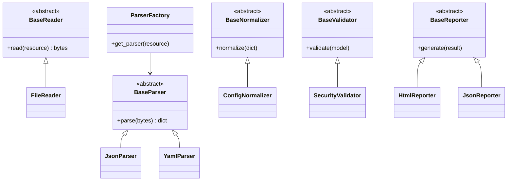
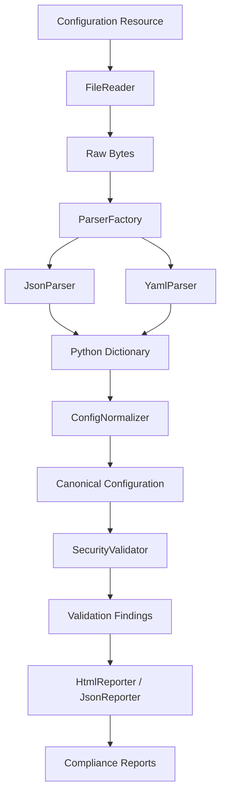
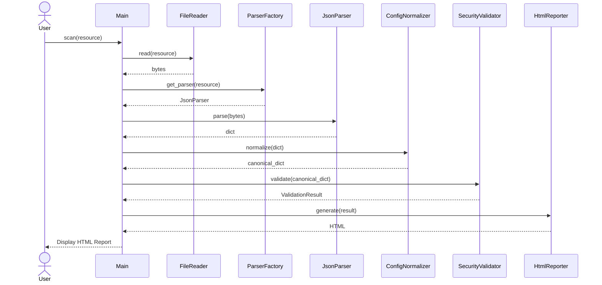

# Class Diagram

---

# Processing Pipeline

---

# Full Runtime Sequence Diagram

---

# ParserFactory

## Purpose

ParserFactory is responsible for selecting and instantiating the appropriate parser implementation based on the configuration resource.

## Responsibilities

- Accept both `str` and `pathlib.Path`
- Normalize file extensions
- Return concrete parser implementations
- Support runtime parser registration
- Raise meaningful domain exceptions

## Non-Responsibilities

- Reading files
- Parsing configuration
- Validation
- Normalization

---

## Design Decisions

### Registry stores parser classes

The registry stores parser classes rather than parser instances.

Reasons:

- fresh parser instance per request
- avoids shared mutable state
- supports dependency injection
- supports dynamic registration
- follows the Open/Closed Principle

### Public API

ParserFactory.get_parser(resource)

Accepts:

- str
- pathlib.Path

Returns:

- BaseParser

Raises:

- FactoryError
- UnsupportedParserError

---

# Adding a Parser
## 1.
Create BaseParser subclass

## 2.
Implement parse()

## 3.
Register with ParserFactory

## 4.
Write tests

## 5.
Update documentation

